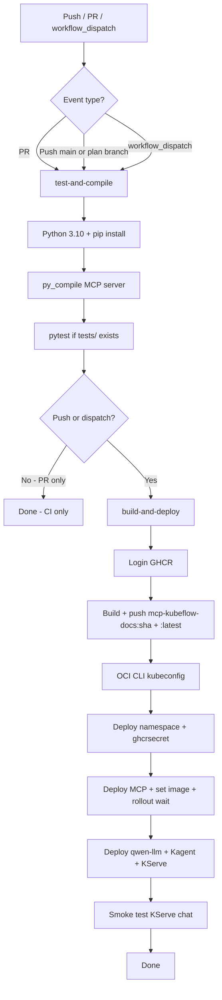

# docs-agent on OKE — Operations Runbook

**Branch:** `plan/cd-and-qwen-kserve`  
**Cluster:** OKE `context-cp5iuhfpl7a` · `us-ashburn-1` · namespace `docs-agent`  
**Maintainers:** You + Santosh

This is the **single reference** for architecture, security (including KServe exposure), work completed, scripts, CI/CD, verification checklists, and next steps.

---

## TL;DR — Is KServe open to the public?

| Question | Answer |
|----------|--------|
| Can anyone on the internet call Qwen? | **No** — not when configured correctly |
| What does Kagent use? | Internal ClusterIP: `http://qwen-llm.docs-agent.svc.cluster.local/openai/v1` |
| Is there a public LoadBalancer for Qwen? | **No** — only ClusterIP services |
| Could Istio expose it? | KServe *can* attach to `kubeflow-gateway`; we **disabled that** with `networking.kserve.io/visibility: cluster-local` |
| What *is* public? | **Kagent UI** (`kagent-ui-lb`) and **Kubeflow Istio ingress** — not the LLM itself |

**Rule:** MCP, Milvus, and KServe stay **ClusterIP / cluster-local only**. Only the chat UI should be public (and should get OAuth or IP allowlist in production).

---

## 1. Architecture (current)

```text
Internet
   │
   ▼
Kagent UI (public LB) ──► kubeflow-docs-agent (ClusterIP)
                                    │
                    ┌───────────────┴───────────────┐
                    ▼                               ▼
         MCP mcp-kubeflow-docs              qwen-llm Service
         (ClusterIP :8000)                  (ClusterIP → predictor pod)
                    │                               │
                    ▼                               ▼
         Milvus my-release-milvus            KServe Qwen GPU pod
         (ClusterIP :19530)                  (internal only)
```

| Component | Image / runtime | Network | Public? |
|-----------|-----------------|---------|---------|
| **Kagent UI** | Helm `kagent` | LoadBalancer `kagent-ui-lb` | **Yes** (intentional) |
| **Agent** | `kubeflow-docs-agent` CR | ClusterIP | No |
| **MCP** | `ghcr.io/<user>/mcp-kubeflow-docs` | ClusterIP `:8000` | No |
| **Milvus** | Helm `my-release-milvus` | ClusterIP `:19530` | No |
| **KServe Qwen** | `kserve/huggingfaceserver:v0.17.0-gpu` | ClusterIP via `qwen-llm` | **No** |
| **KFP pipelines** | namespace `user` | Internal | No |

### Request path (chat with RAG)

1. User opens **Kagent UI** (public LB).
2. UI talks to **kubeflow-docs-agent** in-cluster.
3. Agent calls **KServe** at `qwen-llm.../openai/v1` for LLM inference (internal).
4. Agent calls **MCP** at `mcp-kubeflow-docs...:8000/mcp` for doc search (internal).
5. MCP queries **Milvus** collection `kubeflow_docs_docs_rag`.

---

## 2. Security — KServe and network boundaries

### How Kagent reaches Qwen (safe path)

`kagent-feast-mcp/manifests/kagent/setup.yaml` defines:

```yaml
# ModelConfig kserve-qwen
openAI:
  baseUrl: "http://qwen-llm.docs-agent.svc.cluster.local/openai/v1"
```

`manifests/qwen-llm-service.yaml` is a **ClusterIP** Service that selects the KServe predictor pod directly. This bypasses the Knative `qwen-predictor` ExternalName gateway, which **refused in-cluster connections** and caused Kagent "Connection error".

### Endpoint inventory (verified on cluster)

| Endpoint | Type | Reachable from internet? |
|----------|------|--------------------------|
| `qwen-llm.docs-agent.svc.cluster.local` | ClusterIP → predictor `:8080` | **No** — use this |
| `qwen-predictor-00001-private` | ClusterIP | **No** |
| `qwen-predictor` | ExternalName → `knative-local-gateway` | **No** (internal gateway only) |
| `knative-local-gateway` | ClusterIP | **No** |
| Istio `istio-ingressgateway` | LoadBalancer `129.213.197.159` | **Yes** — Kubeflow ingress (not Qwen direct) |
| Kagent UI `kagent-ui-lb` | LoadBalancer `129.159.180.107` | **Yes** — chat UI |

### Could KServe become public?

KServe in Knative mode can create a VirtualService on `kubeflow-gateway` with hosts like `qwen.docs-agent.example.com`. In our cluster that wiring existed historically; ingress tests returned **403** (auth/routing), but **a private LLM should not have an ingress route at all**.

**Hardening in git** — `manifests/inference-service.yaml`:

```yaml
metadata:
  labels:
    networking.kserve.io/visibility: cluster-local
```

This tells KServe/Knative to keep the InferenceService **cluster-local** and avoid external ingress URLs.

**Apply and verify on cluster:**

```bash
kubectl apply -f manifests/inference-service.yaml

# Should be *.svc.cluster.local — NOT example.com
kubectl get inferenceservice qwen -n docs-agent \
  -o jsonpath='{.status.address.url}{"\n"}'

# qwen-llm must stay ClusterIP
kubectl get svc qwen-llm -n docs-agent
```

**Optional extra lockdown:** confirm no VirtualService routes Qwen to the Istio ingress:

```bash
kubectl get virtualservice -A | grep -i qwen || echo "No qwen VirtualService (good)"
```

### Public vs private — recommendations

| Service | Status | Production recommendation |
|---------|--------|----------------------------|
| KServe Qwen | Internal | **Never expose** — keep `cluster-local` |
| MCP | Internal | **Never expose** — IDE access via `kubectl port-forward` or VPN |
| Milvus | Internal | **Never expose** |
| Kagent UI | Public LB | OK for demo; add **OAuth2 / IP allowlist** for prod |
| Kubeflow / KFP UI | Istio ingress | Behind Kubeflow auth or VPN |

### Secrets hygiene

- GitHub secrets for CD: see [GHCR-CD-SETUP.md](./GHCR-CD-SETUP.md).
- **Never commit** PATs, OCI keys, or HF tokens.
- **Rotate** any token shared in chat or logs.
- `kagent-kserve` secret uses dummy `OPENAI_API_KEY: local-kserve` — KServe predictor has **no auth** on the in-cluster port; security is **network isolation**, not API keys.

---

## 3. Work completed

### KServe Qwen on GPU

| Item | Detail |
|------|--------|
| Model | `Qwen/Qwen2.5-3B-Instruct` via vLLM backend |
| Status | `InferenceService/qwen` **Ready** |
| Image | Pinned `kserve/huggingfaceserver:v0.17.0-gpu` (CUDA 13.1 compatible) |
| Avoid | `latest-gpu` — requires CUDA ≥ 13.2; nodes have 13.1 |
| Tool calling | `--enable-auto-tool-choice`, `--tool-call-parser=hermes` |
| Cluster-local | Label `networking.kserve.io/visibility: cluster-local` |

### GPU node disk fix

OKE GPU nodes (`VM.GPU.A10.1`) have a 250GB boot volume but only ~36GB root FS until LVM is expanded. Large ML images failed with disk pressure.

- Added `manifests/gpu-node-lvm-expand-job.yaml` (growpart → pvresize → lvextend → xfs_growfs).
- Run **once per new GPU node** before pulling huggingfaceserver images.

### Kagent cutover (Groq → KServe)

| Before | After |
|--------|-------|
| Groq external API | In-cluster KServe via `ModelConfig/kserve-qwen` |
| Connection errors | Fixed with stable `qwen-llm` ClusterIP service |
| Agent status | `kubeflow-docs-agent` **Accepted + Ready** |

### GHCR CD (replaced OCIR plan)

- `.github/workflows/oke-cicd.yaml` — build MCP image → GHCR → deploy to OKE.
- Fixed `kagent-feast-mcp/mcp-server/Dockerfile` COPY paths for CI build context.
- MCP manifest uses ConfigMap + `ghcrsecret` imagePullSecret.

### MCP / Milvus alignment

- `server.py` reads Milvus host/collection from env vars.
- Pipeline defaults fixed: `collection_name=kubeflow_docs_docs_rag`, `milvus_host=my-release-milvus.docs-agent.svc.cluster.local`.
- **Known gap:** Milvus was **empty** at last check — MCP returns `collection not found` until ingestion runs ([MILVUS-INGESTION.md](./MILVUS-INGESTION.md)).

### Removed / rejected

- **Standalone vLLM Deployment** — removed; KServe only per requirement.
- **OCIR CD** — skipped; GHCR credentials available instead.

### Issues fixed during bring-up

| Symptom | Root cause | Fix |
|---------|------------|-----|
| KServe not starting | `serving.kserve.io/stop: true` annotation | Remove stop annotation |
| Image pull / disk errors | 36GB root on 250GB volume | LVM expand job |
| CreateContainerError CUDA | `latest-gpu` needs CUDA 13.2+ | Pin `v0.17.0-gpu` |
| Kagent "Connection error" | `qwen-predictor` ExternalName gateway | `qwen-llm` ClusterIP service |
| MCP tool error | Empty Milvus | Run ingestion pipeline (user action) |

---

## 4. Repository layout

```text
manifests/
  inference-service.yaml       # KServe ISVC (cluster-local label)
  serving-runtime.yaml         # huggingfaceserver v0.17.0-gpu
  qwen-llm-service.yaml        # Stable internal OpenAI endpoint for Kagent
  gpu-node-lvm-expand-job.yaml # One-shot GPU node disk expand

kagent-feast-mcp/
  manifests/kagent/setup.yaml        # ModelConfig, Agent, MCP reference
  manifests/mcp-server/mcp-server.yaml
  mcp-server/                        # Python MCP + Dockerfile

scripts/
  deploy-qwen-kserve.sh        # Manual KServe bring-up (no GitHub Actions)

.github/workflows/
  oke-cicd.yaml                # CI + CD pipeline

pipelines/
  github_rag_pipeline.yaml     # Milvus doc ingestion (KFP)

docs/
  OKE-OPERATIONS.md            # This file
  GHCR-CD-SETUP.md             # GitHub secrets
  QWEN-OKE-BRINGUP.md          # KServe/Qwen details
  MILVUS-INGESTION.md          # Fix "collection not found"
  PLAN-OKE-CD-AND-QWEN.md      # Original plan (historical)
```

---

## 5. Scripts explained

### `scripts/deploy-qwen-kserve.sh`

Use when deploying or re-deploying KServe **without** GitHub Actions (local kubectl).

| Step | What it does | Why |
|------|--------------|-----|
| 1 | Applies `gpu-node-lvm-expand-job.yaml` | Ensures enough disk for ML images |
| 2 | Creates `huggingface-secret` if `HF_TOKEN` set | Optional; Qwen2.5-3B is public on HF |
| 3 | Applies serving-runtime, inference-service, qwen-llm | Brings up model + internal endpoint |
| 4 | Removes `serving.kserve.io/stop` annotation | Un-stops a previously stopped ISVC |
| 5 | Waits up to 30m for `InferenceService/qwen` Ready | Model download + GPU scheduling |
| 6 | Smoke test chat completion inside predictor pod | Confirms vLLM responds |

```bash
export HF_TOKEN=...   # optional
./scripts/deploy-qwen-kserve.sh
```

Environment variables:

| Var | Default | Purpose |
|-----|---------|---------|
| `NAMESPACE` | `docs-agent` | Target namespace |
| `HF_TOKEN` / `hf_token` | unset | Hugging Face token for gated models |

### `manifests/gpu-node-lvm-expand-job.yaml`

One-shot Job scheduled on GPU nodes. Expands root filesystem from ~36GB to ~239GB.

```bash
kubectl apply -f manifests/gpu-node-lvm-expand-job.yaml
kubectl wait --for=condition=complete job/gpu-node-lvm-expand -n kube-system --timeout=180s
kubectl logs -n kube-system job/gpu-node-lvm-expand
```

Re-run after **any new GPU node** joins the pool.

---

## 6. CI/CD pipeline

**Workflow file:** `.github/workflows/oke-cicd.yaml`

### Flow diagram



### Triggers

| Event | CI (compile/test) | CD (deploy to OKE) |
|-------|-------------------|---------------------|
| Pull request | Yes | **No** |
| Push to `main` | Yes | **Yes** |
| Push to `plan/cd-and-qwen-kserve` | Yes | **Yes** |
| `workflow_dispatch` (manual) | Yes | **Yes** |

### Job 1 — `test-and-compile`

Runs on every PR and push.

1. Checkout repository
2. Python 3.10
3. `pip install -r kagent-feast-mcp/mcp-server/requirements.txt`
4. `python -m py_compile kagent-feast-mcp/mcp-server/*.py`
5. `pytest` if `tests/` directory exists

### Job 2 — `build-and-deploy`

Runs only on **push** (not PR) or **workflow_dispatch**, after CI passes.

| Step | Action |
|------|--------|
| 1 | Set image tag = git SHA (7 chars) |
| 2 | Login to `ghcr.io` with `GHCR_USERNAME` + `GHCR_TOKEN` |
| 3 | Build MCP Docker image from `kagent-feast-mcp/mcp-server/` |
| 4 | Push `ghcr.io/<user>/mcp-kubeflow-docs:<tag>` and `:latest` |
| 5 | Install OCI CLI; generate kubeconfig for `OKE_CLUSTER_OCID` |
| 6 | Create/update namespace `docs-agent` |
| 7 | Create/update `ghcrsecret` imagePullSecret |
| 8 | Apply MCP manifest; `kubectl set image` to new tag |
| 9 | Wait for MCP rollout (600s timeout) |
| 10 | Apply `qwen-llm-service.yaml`, Kagent `setup.yaml` |
| 11 | Apply KServe serving-runtime + inference-service |
| 12 | Remove ISVC stop annotation if present |
| 13 | Smoke test: wait ISVC Ready + chat completion in predictor pod |

**Note:** CD redeploys KServe manifests on every push. That is intentional so cluster stays in sync with git; first deploy after image/model change can take up to 30 minutes.

### Required GitHub secrets

Configure at **Settings → Secrets and variables → Actions**. Full list: [GHCR-CD-SETUP.md](./GHCR-CD-SETUP.md).

| Secret | Used for |
|--------|----------|
| `GHCR_USERNAME` | GHCR login + image path |
| `GHCR_TOKEN` | GHCR push + cluster pull secret |
| `OKE_CLUSTER_OCID` | kubeconfig target cluster |
| `OCI_USER_OCID`, `OCI_TENANCY_OCID`, `OCI_REGION`, `OCI_FINGERPRINT`, `OCI_KEY_FILE` | OCI CLI authentication |

### First-time CD setup checklist

- [ ] All GitHub secrets configured (rotate any exposed PAT first)
- [ ] Branch merged to `main` (or push to `plan/cd-and-qwen-kserve` for testing)
- [ ] Watch Actions tab for green `build-and-deploy` job
- [ ] Verify MCP pod pulls from GHCR (`kubectl describe pod -n docs-agent -l app=mcp-kubeflow-docs`)
- [ ] Verify KServe smoke test passed in workflow logs

### Manual deploy (without Actions)

See [GHCR-CD-SETUP.md](./GHCR-CD-SETUP.md) for docker build/push + kubectl commands.

---

## 7. Things to check (health checklist)

### After every deploy

```bash
# ── KServe ──
kubectl get inferenceservice qwen -n docs-agent
kubectl get pods -n docs-agent -l serving.kserve.io/inferenceservice=qwen

# Internal LLM from agent namespace
kubectl exec -n docs-agent deploy/kubeflow-docs-agent -- python3 -c "
import urllib.request
print(urllib.request.urlopen(
  'http://qwen-llm.docs-agent.svc.cluster.local/openai/v1/models', timeout=10
).read()[:120])
"

# ── Kagent ──
kubectl get agent,modelconfig -n docs-agent
kubectl get agent kubeflow-docs-agent -n docs-agent \
  -o jsonpath='ModelConfig: {.spec.declarative.modelConfig}{"\n"}'
# Expected: kserve-qwen

# ── MCP + Milvus ──
kubectl rollout status deployment/mcp-kubeflow-docs -n docs-agent
kubectl exec -n docs-agent deploy/mcp-kubeflow-docs -- python3 -c "
from pymilvus import MilvusClient
c = MilvusClient(
  uri='http://my-release-milvus.docs-agent.svc.cluster.local:19530',
  user='root', password='Milvus')
print('collections:', c.list_collections())
"
# Expected: ['kubeflow_docs_docs_rag'] after ingestion
```

### Security checks (run after ISVC changes)

```bash
# Must be cluster-local URL
kubectl get inferenceservice qwen -n docs-agent \
  -o jsonpath='{.status.address.url}{"\n"}'

# Must be ClusterIP
kubectl get svc qwen-llm -n docs-agent -o wide

# Audit all public LoadBalancers
kubectl get svc -A -o wide | grep LoadBalancer
```

### GPU node (after node pool scale-up or replacement)

```bash
kubectl apply -f manifests/gpu-node-lvm-expand-job.yaml
kubectl wait --for=condition=complete job/gpu-node-lvm-expand -n kube-system --timeout=180s
df -h   # on node: root should be ~239G
```

### End-to-end (Kagent UI)

1. Open Kagent UI LoadBalancer URL
2. Select agent `kubeflow-docs-agent`
3. Ask: *"How do I create a KServe InferenceService?"*
4. **Before Milvus ingestion:** LLM responds but tool may fail with `collection not found`
5. **After ingestion:** expect tool call + answer with doc citations

### GitHub Actions

- [ ] Latest workflow run green on your branch
- [ ] `build-and-deploy` pushed image to GHCR (check Packages tab)
- [ ] Smoke test step logged `kserve ok 200`

---

## 8. Milvus ingestion (your action item)

MCP fails with **`collection not found: kubeflow_docs_docs_rag`** when Milvus is empty.

See **[MILVUS-INGESTION.md](./MILVUS-INGESTION.md)**.

Pipeline parameters (already fixed in `pipelines/github_rag_pipeline.yaml`):

| Parameter | Value |
|-----------|-------|
| `milvus_host` | `my-release-milvus.docs-agent.svc.cluster.local` |
| `collection_name` | `kubeflow_docs_docs_rag` |

After ingestion, re-run the Milvus collections check above.

---

## 9. Next steps

| Priority | Task | Owner | Notes |
|----------|------|-------|-------|
| **P0** | Run docs ingestion pipeline → populate Milvus | You | Unblocks MCP tool + citations |
| **P0** | Configure GitHub secrets; verify CD workflow | You + Santosh | Rotate exposed PAT first |
| **P0** | Merge `plan/cd-and-qwen-kserve` → `main` | You + Santosh | CD triggers on `main` push |
| **P1** | Apply `cluster-local` label on live ISVC | Either | `kubectl apply -f manifests/inference-service.yaml` |
| **P1** | Confirm no external KServe URL in ISVC status | Either | See security checks §7 |
| **P1** | Enable Milvus PVC persistence | Either | Survives pod restarts |
| **P2** | Restrict Kagent UI (OAuth2 / IP allowlist) | Either | UI is currently public |
| **P2** | Add `tests/` for MCP + wire into CI | Either | CI currently skips if no tests dir |
| **P2** | Delete unused `kagent-groq` secret | Optional | After KServe stable in prod |
| **P3** | Staging namespace `docs-agent-staging` | Optional | Pre-main deploy validation |
| **P3** | Scheduled incremental doc re-index | Optional | Keep Milvus fresh |
| **P3** | Clean up stuck KFP run `github-rag-rntjb` in `user` ns | Optional | Running since prior session |

---

## 10. Troubleshooting

| Symptom | Likely cause | Fix |
|---------|--------------|-----|
| Kagent "Connection error" | Wrong LLM URL (`qwen-predictor` gateway) | Use `qwen-llm` + `ModelConfig/kserve-qwen` |
| MCP `collection not found` | Milvus empty | Run ingestion ([MILVUS-INGESTION.md](./MILVUS-INGESTION.md)) |
| KServe pod disk pressure | GPU root FS not expanded | `gpu-node-lvm-expand-job.yaml` |
| KServe CreateContainerError CUDA | `latest-gpu` needs CUDA 13.2+ | Pin `v0.17.0-gpu` in serving-runtime |
| CD image pull `ImagePullBackOff` | Missing/bad `ghcrsecret` | Re-run CD or recreate secret |
| Agent answers but no citations | Milvus not indexed | Ingestion pipeline |
| ISVC stuck Not Ready | Stop annotation or GPU scheduling | Remove stop annot; check GPU node taints |
| Workflow smoke test timeout | Cold model download | Normal first time; check pod logs |

---

## 11. Cost saving

Stop GPU predictor when idle (saves A10 GPU node cost if scaled to zero elsewhere):

```bash
# Stop
kubectl annotate inferenceservice qwen -n docs-agent \
  serving.kserve.io/stop=true --overwrite

# Start again
kubectl annotate inferenceservice qwen -n docs-agent \
  serving.kserve.io/stop- --overwrite
```

Or run `./scripts/deploy-qwen-kserve.sh` after removing stop.

---

## 12. Related docs

| Doc | Purpose |
|-----|---------|
| [GHCR-CD-SETUP.md](./GHCR-CD-SETUP.md) | GitHub secrets + manual GHCR deploy |
| [QWEN-OKE-BRINGUP.md](./QWEN-OKE-BRINGUP.md) | KServe image pin, smoke tests, stop/start |
| [MILVUS-INGESTION.md](./MILVUS-INGESTION.md) | Populate Milvus for RAG |
| [PLAN-OKE-CD-AND-QWEN.md](./PLAN-OKE-CD-AND-QWEN.md) | Original migration plan (historical) |
