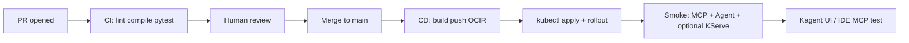

# OKE CD + Qwen/KServe Migration Plan

**Branch:** `plan/cd-and-qwen-kserve` (from `SanthoshToorpu/docs-agent:test-pr`)  
**Cluster:** `context-cp5iuhfpl7a` · OKE `us-ashburn-1` · namespace `docs-agent`  
**Maintainers:** You + Santosh

---

## Current state (as of cluster inspection)

| Component | Status |
|-----------|--------|
| **OKE nodes** | 2× CPU + 1× GPU (`VM.GPU.A10.1`, 1× `nvidia.com/gpu`, taint `nvidia.com/gpu=present:NoSchedule`) |
| **Kagent** | UI LB `129.159.180.107`, Agent `kubeflow-docs-agent` Ready |
| **MCP** | `mcp-kubeflow-docs` on **GHCR** (`ghcr.io/.../mcp-kubeflow-docs:b5f4694`) — not yet wired to OCIR CD |
| **LLM today** | **Groq** via `ModelConfig/groq-llama` → `https://api.groq.com/openai/v1`, model `qwen/qwen3-32b` |
| **KServe** | `InferenceService/qwen` exists, `ServingRuntime/llm-runtime` configured for **Qwen2.5-3B-Instruct + vLLM**, but ISVC has `serving.kserve.io/stop: "true"` → **Stopped**, no predictor pods |
| **Secrets gap** | `huggingface-secret` **missing** (optional in manifest but needed for some HF models) |
| **CI/CD in repo** | `.github/workflows/oke-cicd.yaml` — CI on all PRs; CD on `main` push only |

### Gaps in `oke-cicd.yaml` (to fix in follow-up PRs)

1. Applies wrong paths: `kagent-feast-mcp/manifests/serving-runtime.yaml` — actual files are under `manifests/`.
2. Does **not** `kubectl set image` / patch `Deployment/mcp-kubeflow-docs` with the image built in the same workflow.
3. References `vllm-qwen.yaml` / `gpu-pod.yaml` at repo root — **not in repo**; Qwen spec should live in `manifests/inference-service.yaml` (rename `llama` → `qwen`).
4. No post-deploy smoke test (MCP health, Kagent agent, optional KServe chat).
5. `ocirsecret` created but MCP deployment manifest has no `imagePullSecrets`.

---

## Part 1 — CD on Oracle OKE (OCIR + GitHub Actions)

### Target flow



### Environments (recommended)

| Env | Trigger | Namespace | Image tag | Purpose |
|-----|---------|-----------|-----------|---------|
| **dev/staging** | `push` to `test-pr` or `workflow_dispatch` | `docs-agent-staging` (optional) | `sha` | Pre-merge validation on OKE |
| **prod** | `push` to `main` | `docs-agent` | `sha` + `latest` | Live dogfood cluster |

Start with **prod-only** (matches current workflow); add staging when you want PR-branch deploys without touching prod.

### GitHub Secrets (you + Santosh configure in repo Settings → Secrets)

| Secret | Example / notes |
|--------|-----------------|
| `OCI_REGISTRY` | `iad.ocir.io` |
| `OCI_REPOSITORY` | `<tenancy-namespace>/<repo-name>` e.g. `axxx/kubeflow` |
| `OCIR_USERNAME` | `<tenancy-namespace>/<oci-username>` |
| `OCIR_AUTH_TOKEN` | OCI Auth Token (not console password) |
| `OKE_CLUSTER_OCID` | `ocid1.cluster.oc1.iad....` |
| `OCI_USER_OCID` | For `setup-oci-cli` in Actions |
| `OCI_TENANCY_OCID` | |
| `OCI_REGION` | `us-ashburn-1` |
| `OCI_FINGERPRINT` | API key fingerprint |
| `OCI_KEY_FILE` | PEM private key (multiline secret) |
| `HF_TOKEN` | (optional) Hugging Face token for model pull |
| `KUBECONFIG_BASE64` | (alternative) pre-baked kubeconfig if you prefer not to use OCI API key in CI |

**Action for you:** Share OCIR namespace + confirm MCP image name (`docs-agent` vs `mcp-kubeflow-docs`).

### OCIR + cluster bootstrap (one-time, outside GitHub)

1. Create OCIR repo for MCP image (private recommended).
2. Ensure OKE worker nodes can pull from OCIR (dynamic `ocirsecret` in CD is good; add `imagePullSecrets` to MCP Deployment).
3. GitHub Actions OCI user needs IAM: `CLUSTER_USE` on OKE + read/write OCIR (or instance principal if you move to OCI DevOps later).

### CD workflow changes (implementation checklist)

- [ ] **A.** Fix manifest paths → `manifests/serving-runtime.yaml`, `manifests/inference-service.yaml`.
- [ ] **B.** Add `kagent-feast-mcp/manifests/mcp-server/mcp-server.yaml` with templated image:
  - Use `envsubst` or `kustomize` / `helm` so image = `${REGISTRY}/${REPOSITORY}/docs-agent:${tag}`.
- [ ] **C.** After push, patch deployment:
  ```bash
  kubectl set image deployment/mcp-kubeflow-docs \
    mcp-server=${REGISTRY}/${REPOSITORY}/docs-agent:${tag} -n docs-agent
  kubectl rollout status deployment/mcp-kubeflow-docs -n docs-agent --timeout=300s
  ```
- [ ] **D.** Apply Kagent CRDs if changed: `kubectl apply -f kagent-feast-mcp/manifests/kagent/setup.yaml` (namespace placeholders resolved in overlay).
- [ ] **E.** **Smoke job** (same workflow, after deploy):
  - `curl` MCP: `kubectl run curl-test ...` → `http://mcp-kubeflow-docs.docs-agent:8000/mcp` (or port-forward in CI via `kubectl port-forward` if cluster is private).
  - Optional: call `search_kubeflow_docs` with a known query via MCP inspector / script.
- [ ] **F.** **Pipelines:** CD for KFP is separate — compile/submit pipeline on release tag or manual `workflow_dispatch`; do not block MCP deploy on full doc re-index.

### How to test agentic RAG after each deploy

1. **MCP only (fast):** Cursor/Claude Desktop → remote MCP URL (port-forward or internal LB) → tool `search_kubeflow_docs`.
2. **Kagent UI:** `http://129.159.180.107` (or current LB IP) → agent `kubeflow-docs-agent` → ask Kubeflow-specific question; confirm tool call + citations.
3. **Regression prompts (keep in repo `tests/smoke/`):**
   - "How do I create an InferenceService in KServe?"
   - "KFP v2 disable cache"
   - Greeting (should **not** call MCP tool)

### Repo hygiene (align with `gsoc2026_agentic_rag.md`)

- Move deployables under `deployments/` or `manifests/` with **Kustomize overlays**: `base/`, `overlays/oke-prod/`.
- Pin image tags in git (no `:latest` in prod overlay; CD updates via kustomize `images:` field).

---

## Part 2 — Groq → Qwen2.5-3B-Instruct on KServe

### Why migrate

- **Groq:** hosted API, cost/rate limits, model name `qwen/qwen3-32b` on Groq ≠ self-hosted **Qwen/Qwen2.5-3B-Instruct**.
- **KServe on OKE:** fits Platform WG dogfood; GPU node already provisioned; aligns with GSoC Architecture A/B hybrid (Kagent + self-hosted LLM).

### Cluster facts

- GPU node: **NVIDIA A10 24GB** — sufficient for **Qwen2.5-3B-Instruct** at `--max-model-len=8192`, `--gpu-memory-utilization=0.80`.
- `InferenceService/qwen` already has correct args; blocked by **stop annotation** and never started since stop on 2026-05-23.

### Implementation phases

#### Phase 2.1 — Manifests in git (1 PR)

- [ ] Replace `manifests/inference-service.yaml`: `metadata.name: qwen`, model `Qwen/Qwen2.5-3B-Instruct`, tool parser `hermes`.
- [ ] Keep `manifests/serving-runtime.yaml` (`llm-runtime`, `kserve/huggingfaceserver:latest-gpu`).
- [ ] Add `manifests/huggingface-secret.yaml.example` + document `kubectl create secret generic huggingface-secret --from-literal=token=...`.
- [ ] Remove dead references to `vllm-qwen.yaml` / `gpu-pod.yaml` from workflow unless you add them.

#### Phase 2.2 — Bring up KServe (1 PR + cluster ops)

```bash
# Create HF secret if needed (Qwen2.5-3B-Instruct is generally open; token still helps rate limits)
kubectl create secret generic huggingface-secret -n docs-agent \
  --from-literal=token="$HF_TOKEN"

kubectl apply -f manifests/serving-runtime.yaml
kubectl apply -f manifests/inference-service.yaml

# Unstop / start predictor
kubectl annotate inferenceservice qwen -n docs-agent serving.kserve.io/stop-

kubectl wait --for=condition=Ready inferenceservice/qwen -n docs-agent --timeout=20m
kubectl get pods -n docs-agent -l serving.kserve.io/inferenceservice=qwen
```

**Verify OpenAI-compatible endpoint** (from a pod in cluster):

```bash
curl -s http://qwen-predictor.docs-agent.svc.cluster.local/openai/v1/models
# chat: POST .../openai/v1/chat/completions
```

Exact host may be `qwen-predictor` or Knative URL — confirm with `kubectl get inferenceservice qwen -o jsonpath='{.status.url}'`.

#### Phase 2.3 — Point Kagent at KServe (cutover)

New `ModelConfig` (replace Groq):

```yaml
apiVersion: kagent.dev/v1alpha2
kind: ModelConfig
metadata:
  name: kserve-qwen
  namespace: docs-agent
spec:
  provider: OpenAI
  openAI:
    baseUrl: "http://qwen-predictor.docs-agent.svc.cluster.local/openai/v1"
  model: qwen2.5-3b-instruct   # must match --model_name in InferenceService args
```

Update `Agent/kubeflow-docs-agent`:

```yaml
spec:
  declarative:
    modelConfig: kserve-qwen
```

**Rollout order:** deploy KServe → wait Ready → apply ModelConfig → apply Agent → test UI → remove `kagent-groq` secret when stable.

#### Phase 2.4 — CD includes KServe

- Apply serving manifests on `main` deploy.
- Do **not** auto-restart ISVC every commit unless model args changed (saves GPU download time).
- Optional: `kubectl annotate` stop ISVC on off-hours via CronJob for cost (A10 is expensive idle).

### Risks & mitigations

| Risk | Mitigation |
|------|------------|
| First model pull slow / fails | HF secret; pre-pull on GPU node; smaller `max-model-len` for first boot |
| GPU not scheduled | `nodeSelector` + tolerations already set; verify no other workload consumes GPU |
| Tool calling differs Groq vs vLLM | Keep `--enable-auto-tool-choice` + `--tool-call-parser=hermes`; run Kagent tool-call tests |
| KServe stopped for cost | Document `kubectl annotate ... stop=true/false` in runbook |
| MCP unchanged | RAG retrieval independent of LLM; same Milvus collection |

---

## Suggested PR sequence (you + Santosh)

| # | Branch | Owner | Content |
|---|--------|-------|---------|
| 1 | `fix/cd-manifest-paths-and-mcp-rollout` | Santosh/you | Fix `oke-cicd.yaml`, kustomize MCP image, smoke curl |
| 2 | `feat/kserve-qwen-manifests` | You | Update `manifests/*`, remove llama sample, add runbook |
| 3 | `feat/kagent-kserve-modelconfig` | You | Groq → KServe ModelConfig, test on UI |
| 4 | `chore/staging-env` | Optional | Second namespace + workflow_dispatch |
| 5 | `test/smoke-rag` | Either | pytest + MCP integration in CI (mock Milvus or test ns) |

---

## What we need from you to execute

1. **OCIR:** registry URL, repository path, confirm Actions secrets are set on the GitHub repo used for CD (upstream or fork).
2. **Confirm** prod namespace stays `docs-agent` and whether staging namespace is wanted.
3. **HF token** (optional) for KServe model download.
4. **Approve** Groq cutover window (brief UI downtime during ModelConfig switch).
5. **Merge** `test-pr` → `main` when CI secrets are ready so CD actually runs.

---

## Quick reference — useful commands

```bash
export PATH="$HOME/bin:$PATH"
kubectl config use-context context-cp5iuhfpl7a

kubectl get pods,deploy,inferenceservice,modelconfig,agent -n docs-agent
kubectl describe inferenceservice qwen -n docs-agent
kubectl logs -n docs-agent -l serving.kserve.io/inferenceservice=qwen -c kserve-container -f
```
