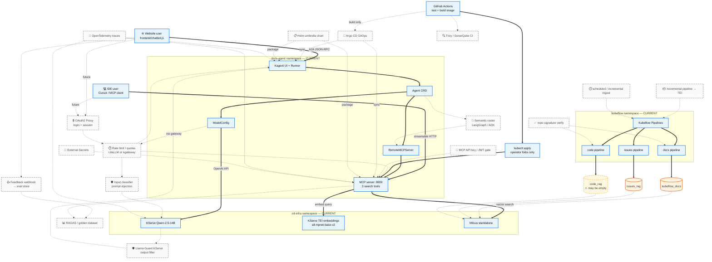
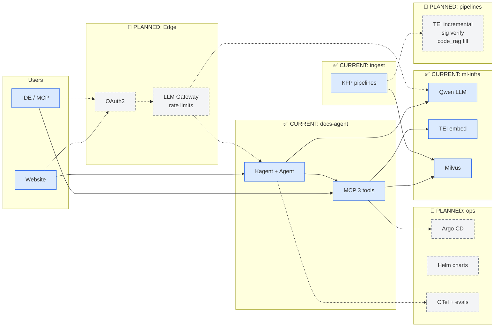
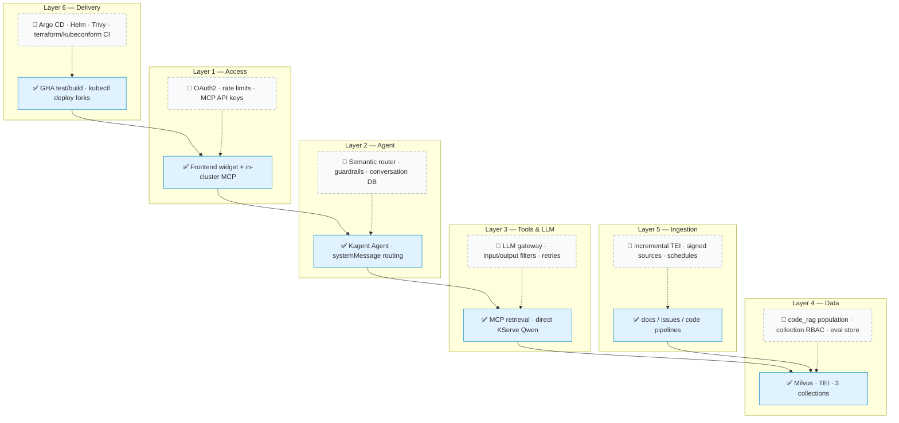

# docs-agent architecture — current + planned improvements

**Legend**

| Style | Meaning |
|-------|---------|
| **Solid boxes / solid arrows** | Shipped today (post-#210) |
| **Dotted boxes / dotted arrows** | Planned improvements (Phase 3 / roadmap) |

Related: [gsoc2026_agentic_rag.md](../../gsoc2026_agentic_rag.md) · [CONTRIBUTION_MAP.md](./CONTRIBUTION_MAP.md)

---

## Combined diagram (current + future overlay)

Copy into slides, GitHub, or any Mermaid renderer.



---

## Simplified slide version (one glance)



---

## Layer view (current vs planned)



---

## ASCII reference (no Mermaid needed)

### Current (solid)

```
 Website / IDE
      │
      ▼
 ┌─ docs-agent ─────────────────────────┐
 │ Kagent ──► Agent ──► MCP (:8000)    │
 │    │              search x3          │
 │    └── ModelConfig ─────────────┐    │
 └────────────────────────────────│────┘
                                  ▼
 ┌─ ml-infra ───────────────────────────┐
 │ Qwen LLM ◄──────────────────────────┘
 │ TEI embeddings ◄── MCP (query embed)
 │ Milvus ◄────────── MCP (search)
 │     ▲
 │     │ kubeflow_docs | issues_rag | code_rag
 └─────┼────────────────────────────────
       │
 ┌─ kubeflow ─ KFP pipelines (docs / issues / code)
 └────────────────────────────────────────

 CI: GHA → pytest → build image → kubectl apply (fork)
```

### Planned improvements (dotted)

```
 - - - - - - - - - - - - - - - - - - - - - - - - - - - - - - - - - - - -
 :  [OAuth2] ──► [LLM Gateway: rate limit · token quota · audit log]    :
 :       │                    │                                         :
 :       └──────────► Kagent / MCP (authenticated)                      :
 :                                                                      :
 :  [Input guard] ──► Qwen ──► [Llama-Guard out] ──► user               :
 :  [Semantic router] ──► tool choice (docs vs issues vs code)         :
 :  [MCP API key] on :8000 if exposed beyond mesh                        :
 - - - - - - - - - - - - - - - - - - - - - - - - - - - - - - - - - - - -

 - - - - - - - - - - - - - - - - - - - - - - - - - - - - - - - - - - - -
 :  Pipelines: incremental→TEI · signed GitHub clones · scheduled runs :
 :  Data: fill code_rag · RAGAS eval · thumbs-up golden dataset        :
 - - - - - - - - - - - - - - - - - - - - - - - - - - - - - - - - - - - -

 - - - - - - - - - - - - - - - - - - - - - - - - - - - - - - - - - - - -
 :  Ops: Argo CD sync · Helm charts · External Secrets · OTel traces    :
 :  CI: Trivy/SonarQube · kubeconform · terraform validate              :
 - - - - - - - - - - - - - - - - - - - - - - - - - - - - - - - - - - - -
```

---

## Improvement backlog by area

| Area | Planned (dotted) | Owner | Community? |
|------|------------------|-------|------------|
| **Security / edge** | OAuth2 proxy, MCP API key, rate limits | Maintainer design | Implement after design issue |
| **LLM gateway** | LiteLLM or kgateway, quotas, logging | Maintainer design | Help with Helm deploy |
| **Guardrails** | Input classifier, Llama-Guard KServe | Maintainer | KServe manifest PRs |
| **Agent core** | Semantic router, prompt hardening | **Maintainer only** | — |
| **MCP** | TEI retry/backoff, structured errors | Maintainer review | ✅ small PRs |
| **Pipelines** | incremental→TEI, sig verify, `code_rag` run | Maintainer + ops | ✅ runbook, TEI migration |
| **Frontend** | Feedback UI, tool-step transparency | Maintainer UX direction | ✅ implementation |
| **Data / eval** | RAGAS, golden dataset from feedback | Maintainer | ✅ eval scripts |
| **GitOps** | Argo CD app-of-apps | Maintainer + Platform WG | ✅ Helm scaffold |
| **IaC** | Helm replaces app-layer TF; dedupe Istio YAML | Maintainer | ✅ packaging |
| **Observability** | OpenTelemetry end-to-end | Maintainer | ✅ instrumentation PRs |
| **CI** | Trivy, kubeconform, terraform validate | — | ✅ good first issues |

---

## This week (mapped to diagram)

| Diagram box | Action |
|-------------|--------|
| `code_rag` (warn) | Run code pipeline — turns dotted “empty” into solid data |
| `FEED` / `EVAL` | File community issue for thumbs up/down |
| `ARGO` / `HELM` | Maintainer spike doc only — stay dotted |
| `GW` / `OAUTH` | Open `maintainer-only` design issue — stay dotted |
| Tests on `MCP` / `TEI` | Community PRs — harden without changing arch |
