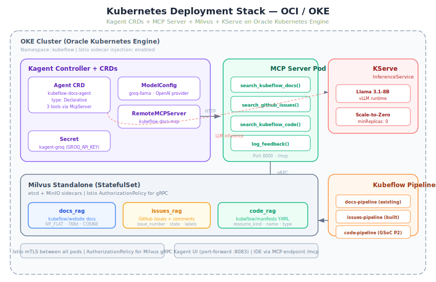
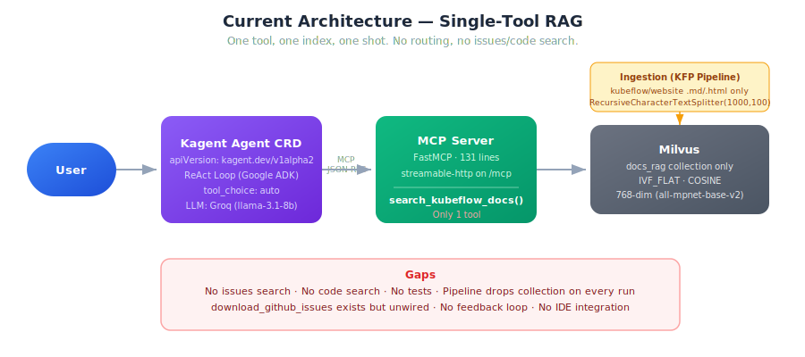
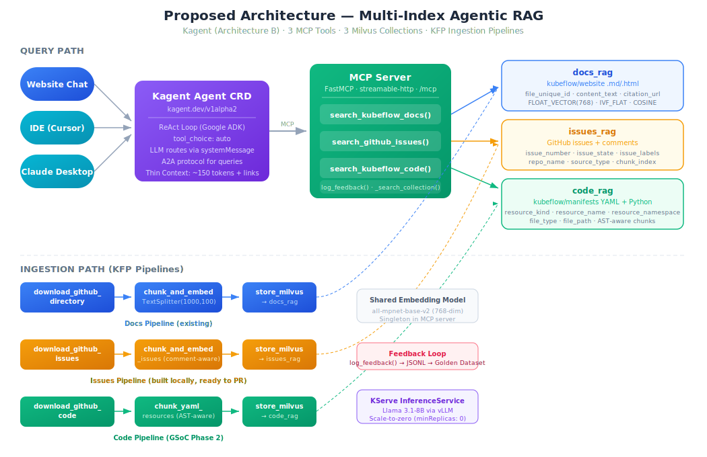
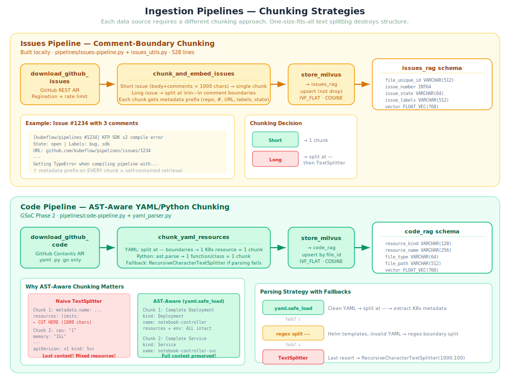
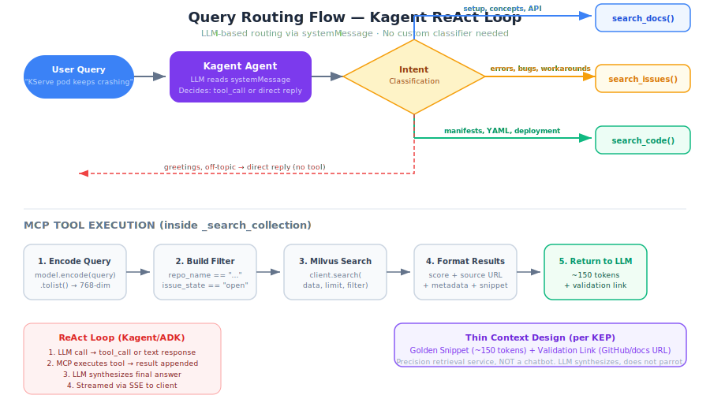
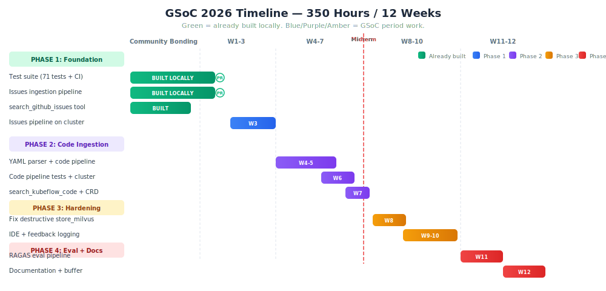

# GSoC 2026 Proposal: Agentic RAG on Kubeflow

**Project Page:** [Agentic RAG on Kubeflow](https://www.kubeflow.org/events/upcoming-events/gsoc-2026/#project-ideas)
**Issue:** [kubeflow/docs-agent#59](https://github.com/kubeflow/docs-agent/issues/59)
**Repo:** [kubeflow/docs-agent](https://github.com/kubeflow/docs-agent)
**Mentors:** @chasecadet, @tarekabouzeid, @SanthoshToorpu
**Project Size:** 350 hours (Large) | **Difficulty:** Hard

---

## Personal Information

- **Full Name:** Rohit Kumar
- **GitHub:** [@kmr-rohit](https://github.com/kmr-rohit)
- **Email:** rr7433446@gmail.com
- **Work:** AI Application Engineer at Oracle 
- **Country of Residence:** India
- **Timezone:** IST, UTC+05:30

---

## 1. Synopsis

I will evolve `kubeflow/docs-agent` from a single-tool RAG system into a multi-index agentic retrieval service with three search tools (docs, issues, code), structured ingestion pipelines, and the project's first test suite. All orchestration uses Kagent (Architecture B). I have deployed the full stack on OCI as part of my work at Oracle, and built the issues pipeline + 71-test suite locally — ready to submit as PRs.

---

## 2. Evidence of Running the System

> _"most proposals are completely AI generated and none made me believe they have the existing architecture set up and running" — @SanthoshToorpu_

### 2a. What I Deployed



I deployed both Kubeflow Platform and the docs-agent stack on OCI with @jaiakash ([deploy-kubeflow](https://github.com/jaiakash/deploy-kubeflow)). Specific things I learned from deploying:

- Milvus standalone requires etcd + MinIO sidecars. The Istio AuthorizationPolicies at `kagent-feast-mcp/manifests/istio/` are needed because Milvus's internal gRPC traffic gets blocked by default mesh policies.
- The Agent CRD at `setup.yaml` uses `apiVersion: kagent.dev/v1alpha2`, references a `RemoteMCPServer` resource, and the Kagent runtime internally uses Google ADK's ReAct loop (migrated from AutoGen).
- Kagent's default Helm install ships agents like `argo-rollouts-conversion-agent` and `cilium-debug-agent` that crash-loop on `CreateContainerConfigError` (missing `kagent-openai` secret) and consume ~2.3GB — these need to be excluded from local dev setup.
- The Groq model `llama3-8b-8192` in the original `setup.yaml` was decommissioned, returning `400 model_decommissioned`. I updated to `llama-3.1-8b-instant`.

### 2b. Bugs Found from Reading Code

- **Destructive pipeline behavior:** `store_milvus` at `pipelines/kubeflow-pipeline.py:338` drops the entire collection before reinserting. If the GitHub API rate-limits you mid-pipeline, the collection ends up empty and agents return nothing.
- **MCP server had hardcoded env vars** — Milvus credentials, namespace, all baked into source code instead of reading from environment. Fixed in my local branch (ready to PR).
- **`download_github_issues` is dead code** — the component at `pipelines/kubeflow-pipeline.py:67-213` is fully implemented (pagination, rate limiting, PR filtering) but not wired into any pipeline. Nobody noticed.
- **Double `@dsl.component` decorator** on `chunk_and_embed` in the kagent pipeline — the outer decorator wins, so it gets `packages_to_install=["requests"]` instead of `["sentence-transformers"]`. Will crash with `ModuleNotFoundError` at runtime.
- **`content_text` truncated to 2000 chars** in Milvus `VARCHAR(2000)` — silently drops context from long documents without warning.

### 2c. Code Built and Ready to Submit

All work below is committed locally on my branch and ready for PR submission. I have been developing against the actual codebase, not prototyping in isolation.

**Completed features:**

| PR / Commit | Description | Status |
|-------------|-------------|--------|
| [PR #140](https://github.com/kubeflow/docs-agent/pull/140) | `search_github_issues` MCP tool + issues ingestion pipeline + Agent CRD update | **Open PR** |
| `ci: add GitHub Actions workflow to build and push MCP server image` | Container build CI | Committed |
| `fix: read config from env vars in MCP server` | Replaced hardcoded credentials with env vars | Committed |
| `feat: add optional LLM_API_KEY support for non-KServe endpoints` | API key support for external LLM providers | Committed |

**Live-tested on OCI cluster:** 1,631 real GitHub issue chunks indexed across 6 repos. Agent correctly routes between docs and issues tools using `qwen/qwen3-32b` on Groq.

### 2d. Test Suite + Pipelines Built Locally

| Component | Files | Lines | Tests |
|-----------|-------|-------|-------|
| Test infrastructure | `tests/conftest.py`, `test_mcp_server.py`, `test_pipeline_utils.py`, `test_issues_pipeline.py` | 900 | 71 tests |
| Issues pipeline | `pipelines/issues-pipeline.py`, `pipelines/issues_utils.py` | 528 | Included above |
| Pipeline utilities | `pipelines/utils.py` | 47 | Included above |
| CI workflow | `.github/workflows/tests.yml` | 33 | - |

---

## 3. Current Architecture (What Exists)



### Data Flow

```
Ingestion: GitHub API (kubeflow/website) → download .md/.html → clean Hugo/HTML artifacts
  → RecursiveCharacterTextSplitter(1000 chars, 100 overlap)
  → all-mpnet-base-v2 (768-dim) → Milvus (docs_rag, IVF_FLAT, COSINE)

Query: User → Kagent Agent CRD (ReAct loop via A2A protocol)
  → LLM decides tool_choice → MCP server's _search_collection()
  → encode query → Milvus search → format markdown with scores + citations
  → LLM summarizes → Response
```

### What is Missing

- Only one Milvus collection (`docs_rag`). No issues or code search.
- `download_github_issues` component exists but is unwired.
- Code ingestion (YAML/AST) does not exist at all.
- Zero tests in the repo.
- Pipeline is destructive (drops collection on every run).
- No feedback loop for golden dataset accumulation.
- No IDE integration (MCP config for Cursor/Claude Desktop).

---

## 4. Proposed Work



### Phase 1: Foundation (Weeks 1-3) — Tests + Issues Pipeline

**Already built locally. Ready to submit as PRs immediately.**

#### Deliverable 1: Test Infrastructure

The repo has zero tests. I built 71 tests across 4 files:

- `tests/conftest.py` — shared fixtures. Pre-mocks `sentence_transformers` and `pymilvus` in `sys.modules` before importing the MCP server module, avoiding 30s+ model downloads in CI.
- `tests/test_mcp_server.py` (402 lines) — tests for `search_kubeflow_docs`, `search_github_issues`, `_search_collection`, `_init()` idempotency, empty results, filter expressions.
- `tests/test_pipeline_utils.py` (179 lines) — tests for `clean_content()`: Hugo frontmatter removal, HTML tag stripping, template syntax cleaning, edge cases.
- `tests/test_issues_pipeline.py` (202 lines) — tests for issues chunking strategy, metadata extraction, short/long issue handling, comment boundary splitting.
- `.github/workflows/tests.yml` — CI workflow running pytest on Python 3.9, 3.11, 3.12.

**Design decision:** I extracted `clean_content()` from `chunk_and_embed` (kubeflow-pipeline.py:246-268) into `pipelines/utils.py` as a pure function. The smallest refactor that enables testability without changing behavior.

#### Deliverable 2: GitHub Issues Ingestion Pipeline



Wires the existing `download_github_issues` component into a complete KFP pipeline:

`download_github_issues → chunk_and_embed_issues → store_issues_milvus`

- **Issues-specific chunking:** Splits at `\n\n---\n` comment boundaries. Prepends metadata prefix (repo, number, URL, labels, state) to every chunk so each chunk is self-contained for retrieval.
- **Short issues** (body + comments < chunk_size) → single chunk.
- **Long issues** → split at comment boundaries first, then `RecursiveCharacterTextSplitter` if individual comments exceed chunk_size.
- **Separate `issues_rag` collection** with issue-specific schema: `issue_number` (INT64), `issue_state` (VARCHAR), `issue_labels` (VARCHAR), `source_type` (VARCHAR).
- **Target repos:** `kubeflow/kubeflow`, `kubeflow/pipelines`, `kubeflow/manifests`

**Question for mentors:** Should this be a separate `issues_rag` collection or partition isolation within `docs_rag`? (relates to Issue #10). Either approach works — `collection_name` is a parameter in my pipeline.

#### Deliverable 3: `search_github_issues` MCP Tool

**Done — [PR #140](https://github.com/kubeflow/docs-agent/pull/140).** Added `search_github_issues` to the MCP server with shared `_search_collection` helper (lines 29-70 of `server.py`). Updated Agent CRD `systemMessage` with two-tool routing:
- `search_kubeflow_docs` → official docs, setup guides, API references, concepts
- `search_github_issues` → error messages, known bugs, workarounds, community solutions

**Key learning from live testing:** Removed `repo`/`state` filter parameters from the tool signature — the LLM over-filtered queries (e.g., always adding `repo: "kserve/kserve"`) which excluded the best semantic matches. Unfiltered search performs significantly better.

---

### Phase 2: Code Ingestion (Weeks 4-7) — The Hard Technical Work

KEP Phase 1 explicitly requires code ingestion for `kubeflow/manifests`.

#### Deliverable 4: YAML/AST-aware Code Ingestion Pipeline

**New files:** `pipelines/code-pipeline.py`, `pipelines/yaml_parser.py`

**YAML-aware chunking (the core challenge):**

Naive `RecursiveCharacterTextSplitter` destroys YAML. A 1000-char chunk can split a Deployment's `resources.limits` from its `metadata.name`, making the chunk useless for retrieval. My approach:

1. Split multi-document YAML at `---` boundaries. Each K8s resource = one chunk.
2. For each YAML document, `yaml.safe_load` and extract: `apiVersion`, `kind`, `metadata.name`, `metadata.namespace`.
3. Store as searchable fields in Milvus.
4. If single YAML doc exceeds chunk_size (rare for K8s resources, common for CRDs), fall back to `RecursiveCharacterTextSplitter` with resource header prepended to every sub-chunk.
5. For `kustomization.yaml` files, preserve entire file as one chunk (they are small, and splitting loses overlay structure).

**Python AST handling:**
- Use `ast` module: each function/class = one chunk with name + docstring + signature.
- File path and line range stored as metadata.
- If AST parsing fails (syntax errors, template files), fall back to text chunking.

**Why `yaml.safe_load` over `ruamel.yaml`:**
- Rejects custom tags (e.g., Helm `{{ .Values }}` templates) cleanly instead of crashing.
- Lighter dependency. When `safe_load` fails, we fall back to text chunking — handles the 90% case well.
- Haroon0x's Issue #120 advocates for regex-based semantic splitting as an alternative to full AST. I'll start with `yaml.safe_load` for clean YAML and regex splitting (`---` boundaries) for templated YAML as fallback.

**New Milvus collection: `code_rag`**

| Field | Type | Notes |
|-------|------|-------|
| id | INT64 | auto PK |
| file_unique_id | VARCHAR(512) | |
| repo_name | VARCHAR(256) | |
| file_path | VARCHAR(512) | |
| resource_kind | VARCHAR(128) | Deployment, Service, etc. |
| resource_name | VARCHAR(256) | metadata.name |
| resource_namespace | VARCHAR(256) | metadata.namespace |
| file_type | VARCHAR(64) | yaml, python, kustomize |
| citation_url | VARCHAR(1024) | |
| chunk_index | INT64 | |
| content_text | VARCHAR(2000) | |
| vector | FLOAT_VECTOR(768) | all-mpnet-base-v2 |
| last_updated | INT64 | |

**Tests:** `tests/test_yaml_parser.py` — multi-doc YAML splitting, K8s metadata extraction, invalid YAML handling, Python AST extraction, fallback when parsing fails.

**Target repo:** `kubeflow/manifests` (Kustomize overlays). Pipeline is parameterized to add repos later.

#### Deliverable 5: `search_kubeflow_code` MCP Tool

```python
@mcp.tool()
def search_kubeflow_code(query: str, resource_kind: str = "", file_type: str = "", top_k: int = 5) -> str:
    """Search Kubeflow Kubernetes manifests, Kustomize overlays, and Python scripts."""
```

Uses `_search_collection` helper from the existing refactor. Optional filters: `resource_kind`, `file_type`.

**Agent CRD update** — 3 tools + routing system prompt:
- `search_kubeflow_docs` → official docs, setup, concepts
- `search_github_issues` → bugs, errors, workarounds
- `search_kubeflow_code` → K8s manifests, Kustomize overlays, deployment configs

---

### Phase 3: Hardening + Developer Experience (Weeks 8-10)

#### Deliverable 6: Fix Destructive Pipeline Behavior

Replace `drop_collection` in `store_milvus` with upsert logic:
- Delete stale records by `file_unique_id` before inserting fresh ones.
- Multiple pipelines can write to their respective collections without interference.
- Pipeline failures mid-run leave partial data instead of zero data.

#### Deliverable 7: Developer IDE Integration

Per the KEP spec — "Developer IDE Mode" is a Phase 1 deliverable.

**Files:** `ide/cursor-mcp-config.json`, `ide/claude-desktop-config.json`, `ide/README.md`

**"Thin Context" response design** (per KEP + mentor spec):
- MCP tools return ~150 tokens + validation links.
- NOT a chatbot — a precision retrieval service.
- The Agent CRD's `systemMessage` already constrains to "2-5 sentences." IDE config files expose the MCP endpoint.

#### Deliverable 8: Feedback Logging

```python
@mcp.tool()
def log_feedback(query: str, response_summary: str, score: int, comment: str = "") -> str:
    """Log user feedback for golden dataset accumulation."""
```

Stores as JSONL on mounted volume: `{timestamp, query, response_summary, score, comment}`.

---

### Phase 4: Evaluation + Documentation (Weeks 11-12)

#### Deliverable 9: RAGAS Evaluation Pipeline

- KFP pipeline running RAGAS metrics against golden dataset.
- Metrics: context precision, context recall, faithfulness, answer relevancy.
- CI integration for regression testing on retrieval quality.

#### Deliverable 10: Documentation

- Architecture decision records (collection strategy, Kagent choice, chunking approach).
- OCI deployment guide (from hands-on experience with @jaiakash).
- Contributor onboarding guide for local dev setup.

---

## 5. Architecture Decisions



### Why Kagent, Not LangGraph

Kagent is Kubernetes-native. The Agent CRD at `setup.yaml` declares tools declaratively. Routing is handled by the LLM's ReAct loop via `tool_choice: auto` — no custom Python state machine needed. The `systemMessage` field handles intent classification: docs queries → `search_kubeflow_docs`, error queries → `search_github_issues`, code queries → `search_kubeflow_code`. This is simpler, testable via the system prompt, and aligns with the merged spec's primary architecture (B).

### Single MCP Server with N Tools

The current `server.py` is 131 lines. All tools share `_search_collection` helper and the same `SentenceTransformer` instance. Adding a tool is ~20 lines of Python + a manifest update. Split into separate servers only when independent scaling is needed — premature now.

### Separate Collections over Partitions

Issues need `issue_number`, `issue_state`, `issue_labels`. Code needs `resource_kind`, `resource_name`, `file_type`. Partitions require a unified schema, which means either nullable fields everywhere or losing type specificity. Separate collections with dedicated schemas are cleaner and each tool queries exactly one collection — no partition filtering overhead.

### Thin Context Design

Per the KEP: "The 'Thin Context' Package: Agent returns ~150 tokens + validation link." MCP tools return structured markdown: score, source URL, metadata fields, content snippet. The LLM synthesizes, does not parrot. This design keeps token costs low and pushes heavy context work to the user's local agent (IDE mode).

---

## 6. Timeline



| Week | Deliverable | Status | Risk |
|------|------------|--------|------|
| 1 | Test suite PR (71 tests + CI) | **Built locally, ready to PR** | Low |
| 2 | Issues pipeline PR | **[PR #140](https://github.com/kubeflow/docs-agent/pull/140) open** | Low |
| 3 | Issues pipeline tested on cluster | **Done — 1,631 chunks on OCI** | ~~Medium~~ Done |
| 4-5 | YAML parser + code pipeline | Design ready | Medium-High |
| 6 | Code pipeline tests + cluster testing | | Medium |
| 7 | `search_kubeflow_code` tool + Agent CRD update | | Low |
| 8 | Fix destructive `store_milvus` + upsert logic | | Medium |
| 9 | IDE integration (Cursor/Claude Desktop configs) | | Low |
| 10 | Feedback logging MCP tool | | Low |
| 11 | RAGAS eval pipeline | | Medium |
| 12 | Documentation + buffer | | Low |

**Weeks 1-3 are already done.** The test suite is built locally, the issues pipeline is submitted as [PR #140](https://github.com/kubeflow/docs-agent/pull/140), and live-tested on OCI with 1,631 real issue chunks across 6 repos.


---

## 7. Qualifications & Experience

### Professional

- **AI Application Engineer at Oracle India** — my day job involves deploying AI/ML workflows on OCI, including model serving, pipeline orchestration, and infrastructure automation on OKE (Oracle Kubernetes Engine). This project directly overlaps with my professional expertise.

### Pre-GSoC Contributions to Kubeflow

- Deployed Kubeflow Platform + docs-agent stack on OCI with @jaiakash ([deploy-kubeflow](https://github.com/jaiakash/deploy-kubeflow))
- Built `search_github_issues` MCP tool with `_search_collection` refactor — [PR #140](https://github.com/kubeflow/docs-agent/pull/140)
- Built issues ingestion pipeline with comment-boundary-aware chunking — [PR #140](https://github.com/kubeflow/docs-agent/pull/140)
- Live-tested on OCI cluster: 1,631 issue chunks indexed, agent routing verified with qwen3-32b
- Built CI workflow for MCP server image builds
- Fixed hardcoded env vars in MCP server
- Added LLM_API_KEY support for non-KServe endpoints
- Built the project's first test suite (71 tests) on a zero-test codebase

### Relevant Skills

- **Python** — daily use at Oracle for AI/ML pipelines, API development
- **Kubernetes/OCI** — professional experience deploying and managing OKE clusters, KServe, Istio
- **RAG systems** — hands-on with Milvus, embedding models, chunking strategies
- **Kubeflow ecosystem** — KFP pipelines, KServe, Kagent CRDs — from actual deployment, not just docs

<!-- Add: other open source contributions, certifications, relevant links -->

---

## 8. Availability

<!-- Adjust hours to match your actual schedule -->
I am committed to dedicating 30-35 hours per week during the GSoC period.

- Weekdays (Mon-Fri): ~4 hours/day (after work hours)
- Weekends (Sat-Sun): ~6-7 hours/day

Regular working time slots:
- 07:00 - 09:00 IST (before work)
- 19:30 - 24:00 IST (after work)

<!-- Add any known unavailability periods, e.g., KubeCon, etc. -->

---

## 9. Why Me

I have already done the work. The 71-test suite, the issues pipeline, the `search_github_issues` MCP tool, and the CI workflow are built and ready to submit. I deployed the full stack on OCI as part of my work at Oracle — this is not a weekend experiment, it is directly adjacent to what I do professionally. I found real bugs (destructive `store_milvus`, double decorator, decommissioned model) and fixed what I could. I am not proposing hypothetical work — I am proposing to finish, harden, and extend work that is already in progress.

---

## Out of Scope (Explicitly)

These are KEP hardening items that are valuable but not core GSoC deliverables:

- OAuth2 / user authentication (himanshu748 has auth middleware PR #67)
- Redis session state / WebSocket long-lived connections
- OpenTelemetry distributed tracing
- Multi-tenancy / RBAC for indices
- Kubecost / OCI billing alerts
- Full chat UI frontend
- Scale-to-zero (KUNDAN1334 is on this)
- Terraform modules (himanshu748 has PR #71)
